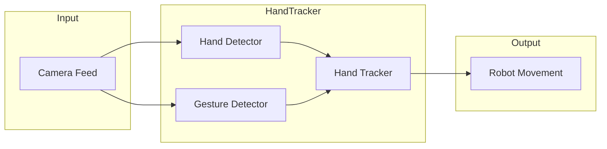

# Robot Operating System (ROS)

## Overview
This hand tracking package controls the MyCobot arm movement to track the hand position as well as react to certain hand gestures.

It takes in the video feed from the camera flange as inputs. For each new image, the system detects the hand position and gestures in parallel. Once those information are available, the hand tracker will compute the desired movement of the robot and send the commands to the MyCobot arm.



## Basic Usage
### Setup
1. Make sure the camera flange is connected to the robot through the USB port.
2. Download the model [gesture_classifier.task](https://storage.googleapis.com/mediapipe-models/gesture_recognizer/gesture_recognizer/float16/latest/gesture_recognizer.task) and put it in the correct path at `/home/er/robotic-arm/HandTracking/gesture_recognizer.task`.

### Launching the package
 In a terminal, after you SSH into the robot, run
```bash
source home/er/launch.sh hand
```

If you want to do it manually after setting up the ROS catkin workspace, you can launch the `hand_tracker` node by running
```bash
roslaunch mycobot_280 hand_tracker.launch
```
in `catkin_ws`.

### Using Foxglove Studio
Foxglove Studio is a very useful software that allows us to visualize ROS data in real time using interactive visualizations in customizable layouts. We can easily use Foxglove Studio to build Graphical User Interface (GUIs) to interact with the robot and understand what the robot system is doing.

1. Make sure you have [Foxglove Studio](https://foxglove.dev/download]) installed in your local environment.
2. Launch hand and gesture tracking through ROS. (see above)
3. In another terminal, after you SSH into the robot, run
```bash
source ~/launch.sh foxglove
```
  to launch the Foxglove websocket on the robot, which will establish the connection to your local Foxglove software.

4. Open Foxglove Studios on your computer (not on the robot), click on "Open Connection", and enter `ws://10.197.94.158:8765` for the WebSocket URL. Click "Open". 

In Foxglove Studio, you can then click on the "Add panel" symbol and choose "Image" for `Image` and `CompressedImage` messages and "Raw Message" for other types of ROS messages. Once a new panel is opened, enter the name of the topic to subscribe to.

## Code Structure
The code is split into the following files:

### `scripts/camera_feed.py`
This file defines the `CameraFeedPublisher` class, which captures video feed from the camera flange, compressing each frame, and publishing them as `CompressedImage` messages on the `camera/rgb/compressed` ROS topic.

### `scripts/hand_detector.py`
This file defines the `HandDetector` class, which detects hands in an image using the Mediapipe library. It subscribes to `camera/rgb/compressed` for receiving `CompressedImage` messages, processes the images to detect hand landmarks, and publishes visualized detections to the `cv/detections_visualized` topic and coordinates of raw detections to the `cv/detections` topic.

### `scripts/gesture_detector.py`
This file defines the `GestureDetector` class, which detects hand gestures in an image using the Mediapipe library. It subscribes to `camera/rgb/compressed` for receiving `CompressedImage` messages, processes the images to detect hand gestures, and publishes the detected gestures as a `HandGesture` message to the `cv/hand_gestures` topic.

### `scripts/hand_tracker.py`
This file defines the `HandTracker` class, which tracks hand positions and gestures to control the MyCobot arm. It subscribes to `cv/detections` and `cv/hand_gestures` for receiving hand position and gesture messages, then adjusts the MyCobot arm joints accordingly.

### `launch/hand_tracker.launch`
This file is the primary launch file for the system.

## Topics
The hand tracking package subscribes and publishes to the following topics:

### `/camera/rgb/compressed`
- Type: `sensor_msgs/CompressedImage`
- Description: The compressed images from the camera flange's live feed.
- Publishers: `camera_feed.py`
- Subscribers:
    - `hand_detector.py`
    - `gesture_detector.py`

### `/cv/detections_visualized`
- Type: `sensor_msgs/Image`
- Description: The visualized detections from `HandDetector`. These are images from the camera flange's live feed, overlaid with bounding boxes drawn around the detected hand's position.
- Publishers: `hand_detector.py`
- Subscribers: None

### `/cv/detections`
- Type: `std_msgs/UInt32MultiArray`
- Description: The detected hand's absolute positions (in pixels) in the image. It must be an array of 2 integers, representing the x and y coordinates of the palm respectively.
- Publishers: `hand_detector.py`
- Subscribers: `hand_tracker.py`

### `/cv/hand_gestures`
- Type: `mycobot_communication/HandGesture`
- Description: The detected hand gesture in the image. It must be one of these following constant values: `NONE`, `CLOSED_FIST`, `OPEN_PALM`, `POINTING_UP`, `THUMB_DOWN`, `THUMB_UP`, `VICTORY`, `I_LOVE_YOU`.
- Publishers: `gesture_detector.py`
- Subscribers: `hand_tracker.py`

## Development
### Modifying Dependencies
If a new source file is added to the package, or if the package's dependencies are modified, the `CMakeLists.txt` and `package.xml` files must be updated to reflect these changes so that catkin can compile the package. You will then need to recompile the catkin environment by running these commands:
```bash
cd ~/catkin_ws
source /opt/ros/noetic/setup.bash
catkin_make --only-pkg-with-deps mycobot_280
source devel/setup.bash

```

#### Adding Python scripts
To add a new Python script to the package, add the file to the `scripts` directory and add the file's name to `PROGRAMS` variable in the `CMakeLists.txt` file. For example, if the file is named `new_file.py`, add the following line to the `CMakeLists.txt` file:
```cmake
catkin_install_python(PROGRAMS
    ...
    scripts/new_file.py
    ...
)
```

#### Adding ROS Dependencies
To add a new ROS dependency to the package, add the dependency to the `find_package` and `catkin_package` calls in the `CMakeLists.txt` file. For example, to add the `new_dependency` dependency, add the following lines to the `CMakeLists.txt` file:
```cmake
find_package(catkin REQUIRED COMPONENTS
    ...
    new_dependency
    ...
)
...
catkin_package(
    CATKIN_DEPENDS ... new_dependency ...
)
```
Also add the dependency to the `package.xml` file. For example, to add the `new_dependency` dependency, add the following line to the `package.xml` file:
```xml
<depend>new_dependency</depend>
```
