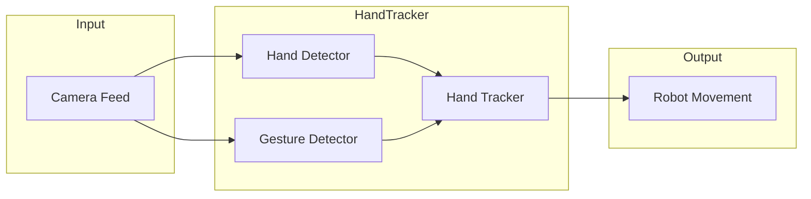

# Robot Operating System (ROS)

## Overview
This hand tracking package controls the MyCobot arm movement to track the hand position as well as react to certain hand gestures.

It takes in the video feed from the camera flange as inputs. For each new image, the system detects the hand position and gestures in parallel. Once those information are available, the hand tracker will compute the desired movement of the robot and send the commands to the MyCobot arm.

